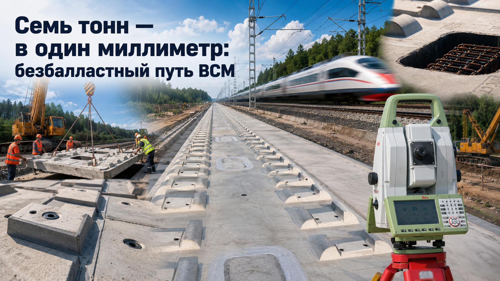
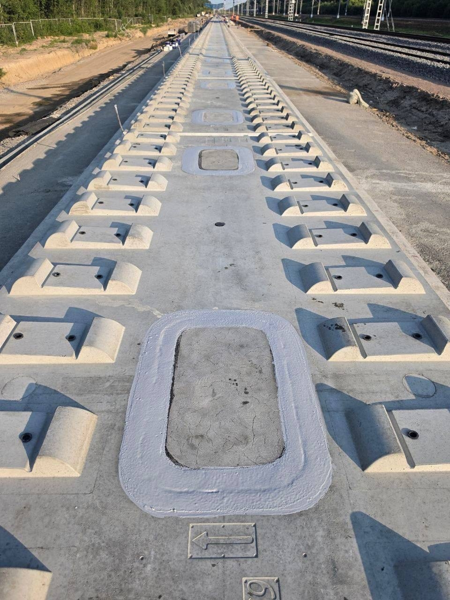
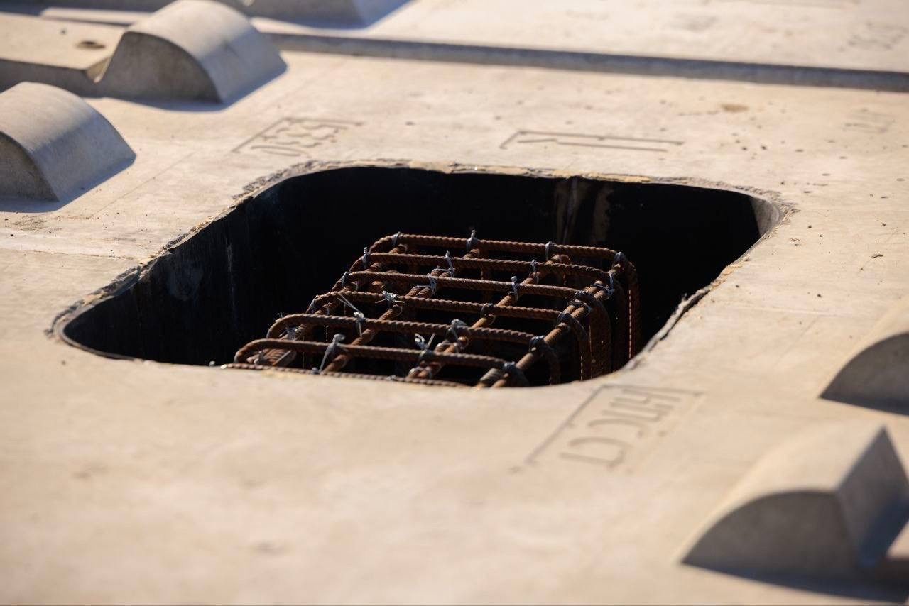
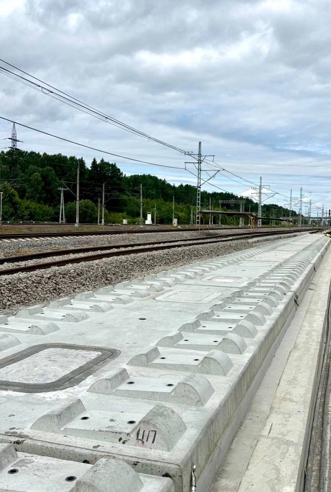
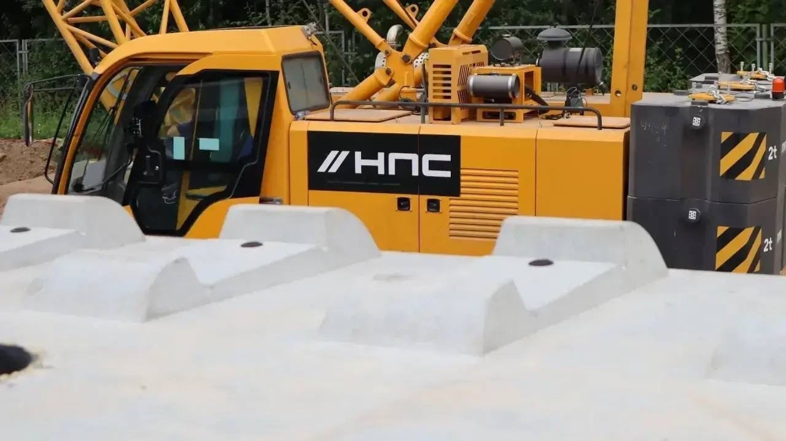
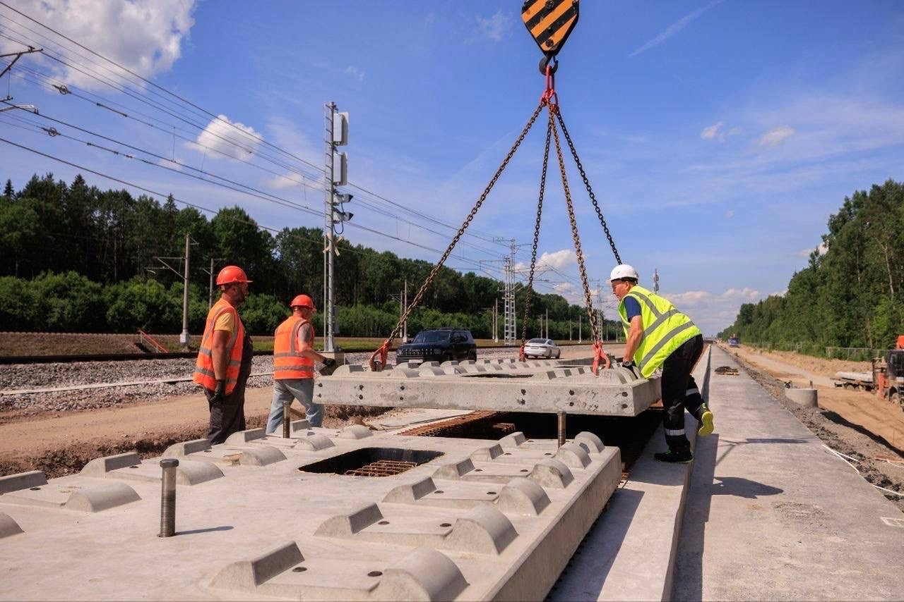
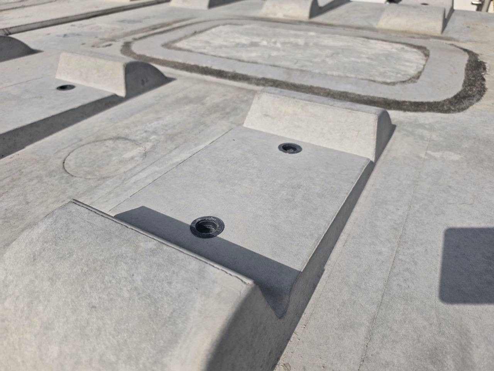

# Семь тонн — в один миллиметр: зачем под Тосно строят безбалластный путь ВСМ

*Кран опускает семитонную бетонную плиту. Монтажники смотрят не на сантиметры — на миллиметр. Эту конструкцию готовят для пути, рассчитанного на скорость до 400 км/ч: 111 метров каждую секунду. А что будет, если основание едва заметно «вздохнёт» под нагрузкой? Натурного ответа пока нет — ради него и построен полигон Саблино — Тосно. Здесь бетон, грунт и русская инженерная школа впервые отвечают на один и тот же вопрос.*

*Цепочка плит НГП 4.0 уже собрана. Пока без рельсов она похожа на гигантскую бетонную шкалу, растянутую вдоль действующего главного хода.*

На фотографиях всё выглядит почти спокойно: светлый бетон, ровные опорные зоны, прямоугольные технологические окна. Нет щебня. Нет привычных шпал. Нет даже рельсов.

Но это не недостроенная железная дорога.

Это экзаменационный стенд длиной больше километра, где проверят безбалластный путь будущей ВСМ Москва — Санкт-Петербург. Компании «Нацпроектстроя» смонтировали здесь **263 бетонные конструкции**: 207 рельсовых плит НГП 4.0 и 56 плит для стрелочных переводов. Следующий ход за РЖД: термоупрочнённые рельсы, скрепления, железнодорожная автоматика, затем многократные проходы «Сапсанов».

И тут возникает неудобный вопрос.

Зачем путь, рассчитанный на 400 км/ч, испытывать поездом, который ходит медленнее?

Потому что скорость — лишь верхушка конструкции. Под ней скрыта более трудная задача: заставить рельс, плиту, бетонный фундамент и земляное полотно годами работать как одно тело. Без дрожи. Без накопленной осадки. Без той маленькой ошибки, которая на обычной дороге останется неровностью, а на высокой скорости превратится в повторяющийся удар.

## Полигон Саблино — Тосно: место, где рендер встречается с грунтом

Будущий поезд можно нарисовать за вечер. Путь так не работает.

На натурном полигоне проверят не отдельную красивую плиту, а весь «бетонный пирог» в сборе — от усиленного земляного полотна до рельсовых скреплений. Грунт будет принимать динамическую нагрузку. Бетон — расширяться на солнце и сжиматься на холоде. Между слоями появятся напряжения, которые не видны на презентации.

Именно поэтому участок устроили рядом с действующей Октябрьской железной дорогой. «Сапсан» здесь нужен не как имитация поезда ВСМ на 400 км/ч, а как хорошо изученный источник повторяемой нагрузки. Полный набор датчиков и измерительных каналов в опубликованном сообщении не раскрыт. Заявленная цель сформулирована строже и честнее: проверить, как реальный подвижной состав воздействует на земляное полотно и безбалластный путь.

Граница эксперимента честная: проходы «Сапсана» не докажут автоматически готовность всей системы к 400 км/ч. Для этого потребуются стендовые, ресурсные, динамические и приёмочные испытания, а затем работа нового российского высокоскоростного поезда на отдельном испытательном участке. Саблино — Тосно решает другую задачу. Здесь расчёт впервые заставляют отвечать перед натурой.

*Под плитой виден арматурный каркас. Через такие проёмы заполняют пространство между верхней конструкцией и фундаментом.*

## Безбалластный путь ВСМ против щебня: спор двух железнодорожных философий

Щебёночный путь не устарел. Он прост по своей идее, хорошо изучен и умеет прощать часть ошибок: геометрию можно восстановить подбивкой, балласт очистить или заменить, локальный дефект — отремонтировать в технологическое окно.

Безбалластный путь живёт по другому закону. Вместо податливой щебёночной призмы появляется жёсткая бетонная система с заранее заданной геометрией. Она должна дольше сохранять положение рельсов и реже требовать выправки. Но за эту стабильность приходится платить точностью строительства. Ошибка основания прячется глубоко, а исправлять её обычно дороже, чем поднять путь домкратами и добавить щебень.

Вот где начинается настоящий спор.

Сторонник балласта скажет: «Дорога должна ремонтироваться быстро и понятными средствами». Сторонник плитной конструкции ответит: «На 400 км/ч лучше один раз построить жёстко, чем десятилетиями догонять уплывающую геометрию».

Международный союз железных дорог не объявляет победителя заранее. Его рекомендации предлагают выбирать между балластным и безбалластным путём под конкретный участок, сравнивая технические параметры, обслуживание и поведение конструкции на всём жизненном цикле. Иными словами, здесь нет религии. Есть инженерный расчёт.

Российский выбор должен учитывать ещё одну вещь — климат. Плита НГП 4.0 разработана под колею 1520 мм, отечественный рельс Р65 и заявленный диапазон температур от −50 до +50 °C. Это уже не копирование чужой схемы. Это попытка собрать собственную систему под собственную дорогу.

## Пять миллиметров внизу. Один миллиметр наверху

Работа начинается не с плиты.

Сначала строители усилили земляное полотно, затем уложили бетонные фундаментные основания. На прямом участке работал автоматизированный бетоноукладочный комплекс. Под стрелочными переводами часть операций выполняли вручную. Допуск по высоте фундамента — **до 5 мм**.

Потом наступил момент, который лучше всего показывает масштаб задачи.

На трёхпозиционные домкраты ставят рельсовую плиту массой около **7 тонн**. Только 207 основных плит дают примерно **1,45 тысячи тонн сборного железобетона**, не считая стрелочных элементов. Для монтажа используют 55-тонный гусеничный кран и 70-тонный автокран. Они поднимают эту массу уверенно. А дальше грубая сила заканчивается.

Плиту нужно выставить с точностью **до 1 мм**.

Не «примерно по оси». Не «почти в отметку». В миллиметр.

*Прибор измеряет положение плиты по четырём контрольным точкам и сравнивает фактические координаты с проектом.*

Роботизированный тахеометр учитывает температуру и время суток. Программное обеспечение разработки «Нацпроектстроя» получает координаты четырёх точек, сверяет их с проектной моделью и сразу показывает, куда сместить плиту.

На бумаге — несколько строк алгоритма. На площадке — солнце, пыль, действующие пути рядом, стропы под нагрузкой и люди, которые знают цену слову «допуск».

Бетон нагревается неравномерно. Металл меняет размеры. Ошибка, пойманная утром, к полудню может выглядеть иначе. Поэтому тахеометр здесь не дорогая игрушка, а посредник между проектной геометрией и живым материалом.

Русская инженерная школа всегда была сильна в этом переходе: от расчёта к вещи, от чертежа к морозу, от формулы к железной дороге, по которой должны ехать люди. Сейчас этот переход виден почти буквально — в зазоре шириной с кончик карандаша.

*Справа — новая плитная конструкция, слева — привычный путь на щебёночном балласте. Две философии лежат рядом, без всякой теории.*

## Что скрыто под плитой НГП 4.0

После геодезической регулировки плиту фиксируют. Затем строители ставят опалубку и через технологические окна подают самоуплотняющийся бетон. Он должен заполнить всё пространство между фундаментом и верхней плитой без вибрирования и без усадки.

Пустота здесь опаснее, чем кажется.

Если под жёсткой плитой останется непроконтролированный зазор, нагрузка перестанет распределяться равномерно. Возникнет локальная зона напряжений: колесо ударит по рельсу, рельс передаст импульс скреплению, дальше нагрузка уйдёт в плиту — и встретит под ней не сплошную опору, а слабое место.

Поэтому самый тихий материал в этой системе, промежуточный бетонный слой, выполняет работу, от которой зависит поведение всего пути.

Есть и малоизвестная деталь. Разработчик сообщает, что плиты НГП 4.0 изготавливают с точностью до **0,5 мм**, а внутрь каждой встраивают RFID-метку — электронный паспорт с данными о составе бетона и координатах элемента на линии. Это уже не просто железобетон. Каждая плита получает биографию.

Но электронный паспорт не отвечает за бетон. Выдержит ли элемент русскую зиму, воду и многократные проходы поездов, должны показать полигон и последующая эксплуатация.

*Кран создаёт усилие. Координаты задаёт геодезия. Между ними — работа монтажников, которую не видно в итоговой статистике.*

## А если плиту придётся менять?

Вот аргумент скептика, от которого нельзя отмахнуться: жёсткий путь прекрасен до первого серьёзного дефекта. Потом выясняется, что бетон нельзя «подбить», как щебень.

Разработчики НГП 4.0 заложили ответ в саму конструкцию. На нижней стороне плиты находится полимерный слой, который должен позволять отделить повреждённый элемент от остального бетонного массива без разрушения фундамента. На стенде ВНИКТИ в Коломне систему нагружали в форсированном режиме: восемь пульсаторов имитировали воздействие тележки высокоскоростного поезда, программа включала **9 миллионов циклов**, заявленных как эквивалент 50 лет эксплуатации. После нагружения конструкцию удалось разделить.

Это сильный результат. Но не финальный.

Стенд подтвердил принцип. Полигон должен показать, как конструкция поведёт себя под настоящим поездом, водой, морозом и неизбежными строительными отклонениями. Окончательный ответ даст эксплуатация. Для пути, которому заявляют ресурс свыше полувека, даже полный стендовый цикл — лишь первая страница биографии.

## Стрелочный перевод 1/25: 118 метров управляемой геометрии

Прямой путь зрелищно прост. Стрелка — совсем другой зверь.

На полигоне собирают два стрелочных перевода марки **1/25**, которые «Нацпроектстрой» называет крупнейшими в России; плитная часть этих узлов уже смонтирована. Длина каждого — **118 метров**. По прямому направлению конструкция рассчитана на скорость до 400 км/ч, по боковому — до 120 км/ч. Для перевода требуется восемь электроприводов.

Почему стрелка такая длинная? Потому что быстрый поезд нельзя резко бросить на другую траекторию. Угол делают положе, переход растягивают, движение остряков и подвижных элементов синхронизируют. Там, где на станционном пути достаточно компактного узла, высокоскоростная магистраль требует целого инженерного сооружения.

56 специальных плит — не приложение к основному километру. Это проверка одного из самых нервных мест ВСМ.

*Плиту опускают на домкраты. После этого начинается медленная доводка тяжёлой конструкции до проектной отметки.*

## Почему «Сапсан» снова стал испытателем

17 декабря 2009 года «Сапсан» отправился в первый коммерческий рейс между Москвой и Петербургом. Тогда дорога за 3 часа 45 минут казалась почти отменой расстояния. Для российского пассажира поезд стал символом новой скорости, хотя ехал по модернизированному историческому ходу вместе с другими категориями движения.

Теперь у «Сапсана» новая роль. Не звезда расписания — измерительный груз.

Его характеристики изучены, проходы можно повторять, а результаты сравнивать. Это позволяет начать полевые испытания до появления первого отечественного поезда для отдельной ВСМ. Логика строгая: сначала проверить, как живёт конструкция под знакомой нагрузкой, затем повышать требования.

Но путать этапы нельзя. «Сапсан» не разгонит этот полигон до проектных 400 км/ч и не заменит будущую сертификацию. Он даст другое — первые честные данные о том, как российский безбалластный путь реагирует на настоящий поезд, а не на стрелку прибора в лаборатории.

## От шести вагонов 1851 года до 400 км/ч

У Саблина и Тосно тяжёлая историческая память. По этому транспортному коридору Россия уже однажды училась сокращать пространство между двумя столицами.

1 (13) ноября 1851 года из Петербурга вышел первый публичный поезд Петербурго-Московской железной дороги. В составе были паровоз, два мягких вагона, три жёстких и багажный. Всего **192 пассажира**. Отправление — в 11:15. Прибытие в Москву — в девять утра следующего дня. Путь занял **21 час 45 минут**.

Тогда дорога длиной 604 версты стала самой протяжённой двухпутной железной дорогой мира. Её строили десять лет. В работах участвовали более **800 тысяч человек**, преимущественно крепостные крестьяне. Инженеры XIX века ещё не знали роботизированного тахеометра, но уже решали ту же русскую задачу: как провести точную линию через леса, реки и тяжёлые грунты.

Потом пришёл ЭР200. В 1972-м стартовала советская программа повышения скоростей на направлении Москва — Ленинград, а уже в 1973-м появился новый электропоезд, рассчитанный на 200 км/ч. Первый регулярный рейс занимал 5 часов 20 минут; позднее время сократили до 4 часов 25 минут. В 2009-м эстафету принял «Сапсан».

Теперь рядом с исторической магистралью лежит бетонная плита с электронным паспортом.

В этом и есть легенда русского главного хода. Не одна победная дата, а длинная цепь попыток: паровоз, скоростной электропоезд, «Сапсан», отдельная ВСМ. Каждое поколение получает своё расстояние между Москвой и Петербургом — и заново спорит, какой ценой его сокращать.

*В резьбовые закладные установят скрепления. Именно они свяжут термоупрочнённый рельс с плитой и зададут требуемую упругость пути.*

## Импортозамещение здесь измеряют не процентами, а миллиметрами

О технологическом суверенитете легко говорить со сцены. На полигоне лозунг исчезает, остаётся перечень вещей, которые обязаны работать вместе: российская плита НГП 4.0, программное обеспечение геодезического контроля, стрелочные переводы для колеи 1520 мм, рельсы, скрепления, автоматика.

Провал одного звена обесценит остальные.

Поэтому патриотический смысл Саблино — Тосно не в том, чтобы заранее объявить испытания успешными. Настоящая уверенность устроена строже. Россия создаёт собственную высокоскоростную систему, проверяет её под нагрузкой и ищет слабое место до массовой укладки. Нашли дефект — исправили. Подтвердили расчёт — пошли дальше.

Так и выглядит зрелая инженерная гордость. Без рекламного тумана.

## Главный риск ВСМ находится ниже рельса

Будущую магистраль длиной **679 км** планируют ввести в эксплуатацию в 2028 году. Заявленная максимальная скорость — до 400 км/ч, расчётное время Москва — Санкт-Петербург — 2 часа 15 минут.

Эти цифры впечатляют. Но судьбу проекта решит не табло в вагоне.

Решит основание.

Сохранит ли земляное полотно геометрию после зимнего промерзания? Не появится ли пустота в промежуточном слое? Насколько быстро удастся заменить повреждённую плиту? Стабильно ли отработают длинные стрелочные переводы? Как поведёт себя система после тысяч проходов, а не после красивого первого рейса?

Вот почему новость о 263 серых плитах важнее очередного изображения будущего поезда. Рендер обещает скорость. Полигон выясняет её цену.

Если испытания подтвердят расчёты, Россия получит не отдельную железобетонную деталь, а технологическую цепочку для сети ВСМ. Если обнаружат слабое место — полигон всё равно выполнит свою задачу. Гораздо разумнее услышать тревожный миллиметр под «Сапсаном» возле Тосно, чем после укладки сотен километров магистрали.

И теперь вопрос к вам — не формальный.

**Что для первой российской ВСМ важнее прямо сейчас: стабильная геометрия безбалластного пути или ремонтная гибкость классического щебня? И готовы ли вы считать ресурс свыше 50 лет доказанным до того, как конструкция переживёт несколько полных циклов промерзания и оттаивания под реальной нагрузкой?**

Пишите. Здесь спорят не фанаты старого и нового. Здесь сталкиваются две честные инженерные логики — и цена ошибки измеряется уже не словами, а миллиметрами.

---

## Источники

1. [«Нацпроектстрой»: завершён монтаж 263 рельсовых плит на полигоне Саблино — Тосно](https://npsgk.ru/news/kompanii-natsproektstroya-zavershili-montazh-relsovykh-plit-na-poligone-sablino-tosno/)
2. [«Нацпроектстрой» и РЖД: устройство полигона и параметры стрелочных переводов 1/25](https://npsgk.ru/news/natsproektstroy-i-rzhd-zavershayut-ustroystvo-poligona-dlya-pervykh-polevykh-ispytaniy-bezballastnog/)
3. [«Нацпроектстрой»: стендовые испытания безбалластного пути во ВНИКТИ](https://npsgk.ru/news/v-kolomne-startovali-kompleksnye-ispytaniya-bezballastnogo-puti-vsm-razrabotki-natsproektstroya/)
4. [«Нацпроектстрой»: патент и технические особенности плиты НГП 4.0](https://npsgk.ru/news/relsovaya-plita-dlya-vsm-poluchila-patent-na-izobretenie/)
5. [Минтранс России: длина, время в пути и срок ввода ВСМ Москва — Санкт-Петербург](https://mintrans.gov.ru/press-center/branch-news/7707)
6. [Минтранс России: ЭР200, «Сапсан» и развитие высокоскоростного движения](https://mintrans.gov.ru/press-center/news/12286)
7. [ОАО «РЖД»: открытие движения поездов «Сапсан» 17 декабря 2009 года](https://company.rzd.ru/ru/9397/page/104069?accessible=true&id=39863)
8. [Президентская библиотека: открытие Петербурго-Московской железной дороги в 1851 году](https://www.prlib.ru/history/619715)
9. [Международный союз железных дорог: выбор между балластным и безбалластным путём](https://uic.org/com/enews/article/uic-publishes-first-edition-of-irs-70727-railway-application-track)

#ВСМ #безбалластныйпуть #СаблиноТосно #МоскваПетербург #НГП40 #РЖД #железныедороги

---

**Что изменено:** утверждение «здесь поезд пойдёт 400 км/ч» заменено точной формулировкой о расчётной скорости конструкции и роли «Сапсана» как испытательной нагрузки; блоки об RFID, стендовых циклах и зимней эксплуатации получили открытый вопрос вместо преждевременной уверенности; справочный абзац об ЭР200 перестроен в живую и хронологически точную эстафету 1972 → 1973 → регулярное движение → «Сапсан».

**Без изменений оставлены:** проверенные цифры исходного материала — 263 конструкции, 207 рельсовых плит, 56 стрелочных плит, точность монтажа до 1 мм, масса около 7 тонн, краны грузоподъёмностью 55 и 70 тонн, самоуплотняющийся бетон и будущая нагрузка от «Сапсанов».
